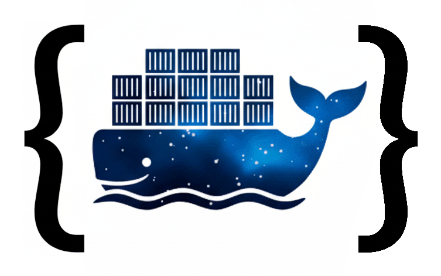

# SpaceAPI Endpoint

[](https://github.com/q30-space/spaceapi-endpoint/actions/workflows/ci.yml)

An API server for a [SpaceAPI](https://spaceapi.io/) endpoint.


## Overview

SpaceAPI-Endpoint provides a REST API that follows the [SpaceAPI v15 specification](https://spaceapi.io/docs/) to expose real-time information about the hackerspace status.

## Configuration

### SpaceAPI Configuration
Copy `spaceapi.json.example` to `spaceapi.json`.

The SpaceAPI configuration is stored in `spaceapi.json`. Key sections:

- **Basic Info**: Space name, logo, URL
- **Location**: Address, coordinates, timezone
- **Contact**: Email, IRC, social media
- **State**: Current open/closed status
- **Sensors**: People count, temperature, etc.
- **Feeds**: Blog RSS, calendar feeds

For full documentation check the [SpaceAPI Schema Documentation](https://spaceapi.io/docs/) .

### Authentication Setup

1. **Copy the environment template**:
   ```bash
   cp .env.example .env
   ```

2. **Generate a secure API key**:
   ```bash
   openssl rand -hex 32
   ```

3. **Set your API key in `.env`**:
   ```bash
   # Edit .env file
   SPACEAPI_AUTH_KEY=your_generated_key_here
   ```

4. **For Docker Compose**:
   The `.env` file is automatically loaded by Docker Compose.

5. **For manual scripts**:
   ```bash
   export SPACEAPI_AUTH_KEY=your_generated_key_here
   ./scripts/update-space-status.sh open
   ```

## Deployment

### Docker Image (Recommended) 🐳

The easiest way to deploy is using the pre-built Docker image from GitHub Container Registry:

1. Copy [docker-compose-prod.yml](../docker-compose.prod.yml) to your host.
2. Create your `.env` and `spaceapi.json` files as described in the [Configuration section](#configuration).
3. `docker-compose up -d`

**For other deployment options, check the [Deployment Guide](doc/DEPLOYMENT_GUIDE.md).**


## API Documentation

The complete API is documented using the [OpenAPI Specification (OAS) 3.0](https://swagger.io/specification/) in [`openapi.yaml`](openapi.yaml).

### Quick Start with Swagger UI

```bash
# View interactive API documentation
make openapi-ui
```

Then visit http://localhost:8081 to browse and test the API.

### Other Options

You can also view and interact with the API documentation using:
- **Swagger UI**: Upload `openapi.yaml` to [Swagger Editor](https://editor.swagger.io/)
- **Redoc**: Use [Redocly](https://redocly.github.io/redoc/) for beautiful API docs
- **VS Code**: Use the [OpenAPI (Swagger) Editor](https://marketplace.visualstudio.com/items?itemName=42Crunch.vscode-openapi) extension

**For detailed information about the OpenAPI specification, client generation, and more, see the [OpenAPI Documentation](doc/OPENAPI.md).**

### GET `/api/space`
Returns the complete SpaceAPI JSON response.

**Example:**
```bash
curl http://localhost:8089/api/space
```

### POST `/api/space/state` 🔒
Updates the space state (open/closed status). **Requires API key authentication.**

**Headers:**
```
X-API-Key: your_api_key_here
Content-Type: application/json
```

**Payload:**
```json
{
    "open": true,
    "message": "Space is open for members",
    "trigger_person": "John Doe"
}
```

**Example:**
```bash
curl -X POST \
  -H "X-API-Key: your_api_key_here" \
  -H "Content-Type: application/json" \
  -d '{"open": true, "message": "Space is open"}' \
  http://localhost:8089/api/space/state
```

### POST `/api/space/people` 🔒
Updates the people count in the space. **Requires API key authentication.**

**Headers:**
```
X-API-Key: your_api_key_here
Content-Type: application/json
```

**Payload:**
```json
{
    "value": 5,
    "location": "Main Space"
}
```

**Example:**
```bash
curl -X POST \
  -H "X-API-Key: your_api_key_here" \
  -H "Content-Type: application/json" \
  -d '{"value": 5, "location": "Main Space"}' \
  http://localhost:8089/api/space/people
```

### POST `/api/space/event` 🔒
Adds an event to the space timeline. **Requires API key authentication.**

**Headers:**
```
X-API-Key: your_api_key_here
Content-Type: application/json
```

**Payload:**
```json
{
    "name": "John Doe",
    "type": "check-in",
    "extra": "Working on Arduino project"
}
```

**Example:**
```bash
curl -X POST \
  -H "X-API-Key: your_api_key_here" \
  -H "Content-Type: application/json" \
  -d '{"name": "John Doe", "type": "check-in"}' \
  http://localhost:8089/api/space/event
```

## Authentication & Rate Limiting

### API Key Authentication
All POST endpoints require authentication via API key. 

Check the Configuration section below.

### Rate Limiting
Failed authentication attempts are rate limited to mitigate brute force attacks:

- **Limit**: 5 failed attempts within 15 minutes
- **Block Duration**: 1 hour
- **Response**: HTTP 429 Too Many Requests with `Retry-After` header
- **Scope**: Per IP address

### Error Responses

| Status | Description | Response |
|--------|-------------|----------|
| 401 | Missing or invalid API key | `"API key required"` or `"Invalid API key"` |
| 403 | API key format invalid | `"Access forbidden"` |
| 429 | Rate limited | `"Too many failed authentication attempts. Please try again later."` |


## Management Scripts

### Update Space Status
```bash
# Open the space
./scripts/update-space-status.sh open "Open for members" "John Doe"

# Close the space
./scripts/update-space-status.sh closed "Closed for maintenance" "Jane Smith"
```

### Update People Count
```bash
# Set people count
./scripts/update-people-count.sh 5 "Main Space"

# Set to zero
./scripts/update-people-count.sh 0
```

## Building

### Build Binary
```bash
# Build spaceapi server
make build

# Or build directly
go build -o bin/spaceapi ./cmd/spaceapi
```

### Development
```bash
# Run the SpaceAPI server
make run
# or
go run ./cmd/spaceapi
```

## Testing

The project includes a comprehensive test suite covering all critical components.

### Unit Tests

```bash
# Run all tests (recommended)
make test

# Run with verbose output
make test-verbose

# Run with coverage
make test-coverage

# Generate HTML coverage report
make test-coverage-html
```

Or run directly with Go:
```bash
# Run all tests
go test ./internal/... ./cmd/...

# Run tests with verbose output
go test -v ./internal/... ./cmd/...

# Run tests with coverage report
go test -cover ./internal/... ./cmd/...

# Run tests for specific packages
go test ./internal/handlers ./internal/middleware

# Run tests with detailed coverage
go test -coverprofile=coverage.out ./internal/handlers ./internal/middleware
go tool cover -html=coverage.out
```

### End-to-End Tests

The CI pipeline includes comprehensive E2E tests that validate the Docker container against the OpenAPI specification using [Schemathesis](https://schemathesis.readthedocs.io/).

**Test Coverage:**
- ✅ OpenAPI conformance testing (all endpoints)
- ✅ Authentication and authorization
- ✅ Request/response schema validation
- ✅ Data persistence verification
- ✅ Error handling

**For detailed information about E2E testing, including how to run tests locally, see [E2E Testing Documentation](doc/E2E_TESTING.md).**

## Security Considerations

1. **API Authentication**: POST endpoints now require API key authentication via `SPACEAPI_AUTH_KEY` environment variable.
2. **Rate Limiting**: Failed authentication attempts are rate limited (5 attempts in 15 minutes = 1 hour block).
3. **HTTPS Required**: Production deployments must use HTTPS to protect API keys in transit.
4. **Key Management**: API keys should be rotated regularly and stored securely.


### Example JavaScript Integration

```javascript
// Fetch space status
fetch('http://localhost:8089/api/space')
  .then(response => response.json())
  .then(data => {
    const statusElement = document.getElementById('space-status');
    if (data.state && data.state.open) {
      statusElement.textContent = 'Space is OPEN';
      statusElement.className = 'status-open';
    } else {
      statusElement.textContent = 'Space is CLOSED';
      statusElement.className = 'status-closed';
    }
  });
```

## Monitoring

- **Health Checks**: Both services have health check endpoints
- **Logs**: Check Docker logs for issues

## Troubleshooting

### Common Issues
1. **API not responding**: Check if the spaceapi service is running
2. **CORS errors**: Ensure the API URL is correct
3. **JSON parsing errors**: Validate your JSON payloads

### Debug Commands

```bash
# Check service status
docker-compose ps

# View API logs
docker-compose logs spaceapi

# Test API endpoint
curl http://localhost:8089/health

# Test SpaceAPI endpoint
curl http://localhost:8089/api/space
```

## Project Structure

```
spaceapi-endpoint/
├── cmd/
│   └── spaceapi/          # SpaceAPI server
├── internal/
│   ├── handlers/          # HTTP handlers
│   ├── middleware/        # Auth, CORS middleware
│   ├── models/           # Data models
│   ├── services/         # Business logic
│   └── testutil/         # Test helpers
├── doc/                  # Documentation
│   ├── OPENAPI.md        # OpenAPI documentation
│   ├── E2E_TESTING.md    # End-to-end testing guide
│   ├── DEPLOYMENT_GUIDE.md
│   └── ...
├── scripts/              # Management scripts
├── bin/                  # Built binaries
├── openapi.yaml          # OpenAPI 3.0 specification
├── spaceapi.json         # Configuration
└── Makefile             # Build automation
```

